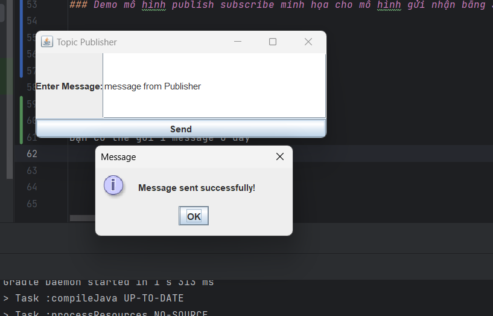
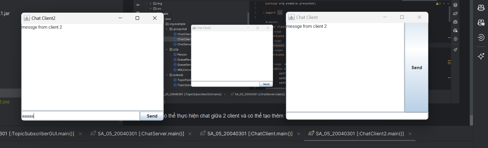

# Lab05 - Kiến trúc và thiết kế phần mềm

## Yêu cầu 

Thực hiện mô hình point to point minh họa cho mô hình gửi nhận bằng JAVA

Thực hiện mô hình publish subscribe minh họa cho mô hình gửi nhận bằng JAVA

Thực hiện chương trình group chat và chat client bằng JAVA

### Công cụ và thư viện 

- **APACHE ACTIVEMQ** : Apache ActiveMQ là một message broker mã nguồn mở, được viết bằng Java. Nó cung cấp một giải pháp trung gian thông điệp cấp doanh nghiệp để kết nối ứng dụng, hệ thống và dịch vụ. ActiveMQ hỗ trợ "mô hình gửi nhận" và "publish-subscribe" và có thể được triển khai trong môi trường phân tán và tích hợp với các ứng dụng Java EE và Spring.
- **JAXB API** : JAXB là một API trong Java cho phép ánh xạ các đối tượng Java thành các tài liệu XML và ngược lại. Nó cung cấp các công cụ để tự động tạo mã Java từ tập tin XML và ngược lại, giúp đơn giản hóa việc làm việc với dữ liệu XML trong ứng dụng Java.
- **JMS API** : Java Message Service (JMS) là một API trong Java để gửi và nhận các thông điệp giữa các ứng dụng, hệ thống và dịch vụ. Nó cung cấp một cách tiêu chuẩn để tạo, gửi và nhận các thông điệp, giúp tạo ra các ứng dụng phân tán và tích hợp.
- **Log4j** : Log4j là một thư viện logging phổ biến trong Java, cho phép ứng dụng ghi lại thông tin log một cách linh hoạt và dễ dàng điều chỉnh. Nó cung cấp các cấu hình linh hoạt cho việc xác định cách mà thông điệp log được xử lý và lưu trữ, giúp dễ dàng theo dõi và phân tích hệ thống.

Thêm các phụ thuộc sau vào tệp cấu hình của dự án:
```groovy
    implementation 'javax.xml.bind:jaxb-api:2.3.0'
    implementation 'javax.jms:javax.jms-api:2.0.1'
    implementation 'log4j:log4j:1.2.17'
    implementation 'org.apache.activemq:activemq-all:5.16.3'
    implementation 'javax.activation:javax.activation-api:1.2.0'
```

### Demo mô hình point to point minh họa cho mô hình gửi nhận bằng JAVA

Run class QueueReceiver 


Sau đó sẽ nhận được 1 GUI 


Run class QueueSender


Sau đó sẽ nhận được 1 GUI


Tiếp theo bạn có thể chat ở phần sender và bấm send: 


Phần chat từ sender sẽ được cập nhật lại


### Demo mô hình publish subscribe minh họa cho mô hình gửi nhận bằng JAVA

Run class TopicPublisher ,Run class TopicSubscriber

 

Sau đó sẽ nhận được 1 GUI

Bạn có thể gửi 1 message ở đây và bấm xem



Bạn sẽ nhận được một message ở Subscriber


### Demo chương trình group chat và chat client bằng JAVA

Ở đây mình hoa có 2 client

Run class ChatServer


Bạn sẽ nhận được thông báo là chươn trình đã chạy

Run class ChatClient

Run class ChatClient2


Sau đó bạn có thể thực hiện chat giữa 2 client và có thể tạo thêm 1 số client để  test từ 2 client cơ bản 




